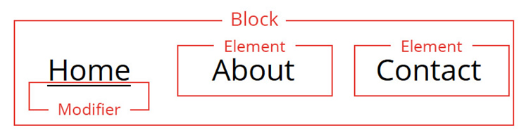

## Introduction to BEM

One of the trickiest things to do in development is deciding what to name things.

This becomes specifically important when working in a team, as everyone needs to use the same naming convention to avoid any confusion and name conflicts.

BEM stands for ‘Block Element Modifier’ and is used to structure and organize your CSS class names. It facilitates consistent and predictable naming and is especially useful when working with CSS pre-processors.

## BEM

A Block is a distinct part of a web page and groups a series of elements. It forms the base name for the class (.block).

An Element is a child item of a block and uses two underscores to separate it from the block name (.block\_\_element).

A Modifier changes a block or element based on specific circumstances and is separated by two hyphens (.block—-modifier or .block\_\_element—-modifier).

In the example below, the navigation is considered the block, each item inside the navigation is an element, and an active class is added to the home element.



Using the BEM methodology we could name the classes:

- .navbar
- .navbar\_\_item
- .navbar\_\_item--active

The benefits of using BEM include:

- BEM blocks are re-useable.
- Block styles are never dependent on other elements.
- It is easy to transfer BEM blocks from one project to another.

### BEM in HTML

Let’s look at how BEM is implemented in HTML. There are three examples for you to consider:

#### Example 1

<!-- prettier-ignore -->
```html
    <ul class="navbar">
      <li class="navbar__item">
        <a href=" class="navbar__link--active">Home</a>
      </li>
      <li class="navbar__item">
        <a href=" class="navbar__link">About</a>
      </li>
      <li class="navbar__item">
        <a href=" class="navbar__link">Contact</a>
      </li>
    </ul>
```

The block is the outer most container for a group of items. Everything inside the block will inherit the block's name. This is to ensure that we know exactly which elements and modifiers belong to that specific block.

In the above example navbar is the block for a group of items that are all related.

Inside the navbar block are list items with their class names comprised of their block name, two underscores and their element name.

The tags are also elements and are named the same way as the items. That they are nested inside the items is not important.

The first link is active so we give it a modifier name called "active" separated from the rest of its class name by two hyphens.

#### Example 2

<!-- prettier-ignore -->
```html
<div class="gallery">
  
  
  
</div>
```

Here "gallery" is the block, each image in the gallery is an element and the selected image has the modifier name "selected" added to its class name.

#### Example 3

<!-- prettier-ignore -->
```html
<button class="btn"></button>
<button class="btn btn--primary"></button>
```

The two buttons above are both block components. The second button is a variation so receives a modifier class.

### Practical examples with SASS
